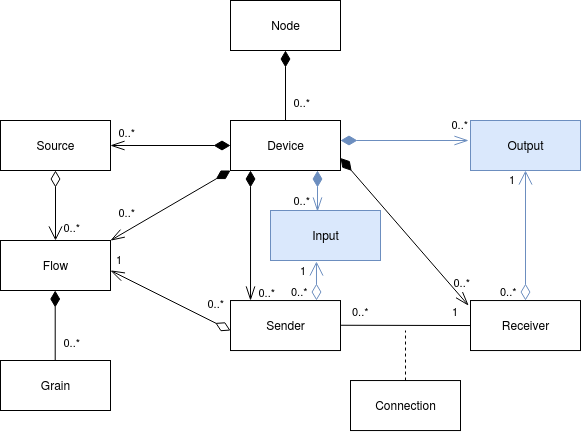

# Data Model: Identifier Mapping

[IS-04][IS-04] uses a logical data model which is extended in this specification with the addition of the Sink resources.
All the language in IS-04 takes precedence.

In order to ensure consistent behaviour in a facility employing this identity, some rules apply when generating and handling identifiers.

## Identity Hierarchy

The IS-04 heirarchy is preserved with the exception of the addition of a Receiver can identify an association with 0 or more Sink resources.

## Sink Representation

A new Sink is created in the following circumstance:

- At the presence of a physical display
- At the point of capture for a baseband connection

## Identifier Persistence

As per IS-04,

> Persistent identity helps to ensure that users’ expectations meet with reality. For example, if a piece of equipment is switched off and back on, the user would expect it to return with [...] the identifiers used by the Node remain the same.

### Sink ID

Owned by:

- Device ID

SHOULD change if:

- Device ID changes
- A different physical interface (such as an HDMI input) is mapped to consume the essence
- A different physical display is connect to the same interface (using the manufacure information. serial number, or unique identifier)

SHOULD NOT change if:

- Configuration parameters associated with the Flow are changed, such as its operating resolution or bitrate
- A Device is re-configured, adding or removing some Sinks, but keeping this one

It is suggested that Receiver IDs be generated using the combination of:

- The parent Device ID
- An input connection identifier such as a channel name, index or similar

[IS-04]: https://specs.amwa.tv/is-04/
